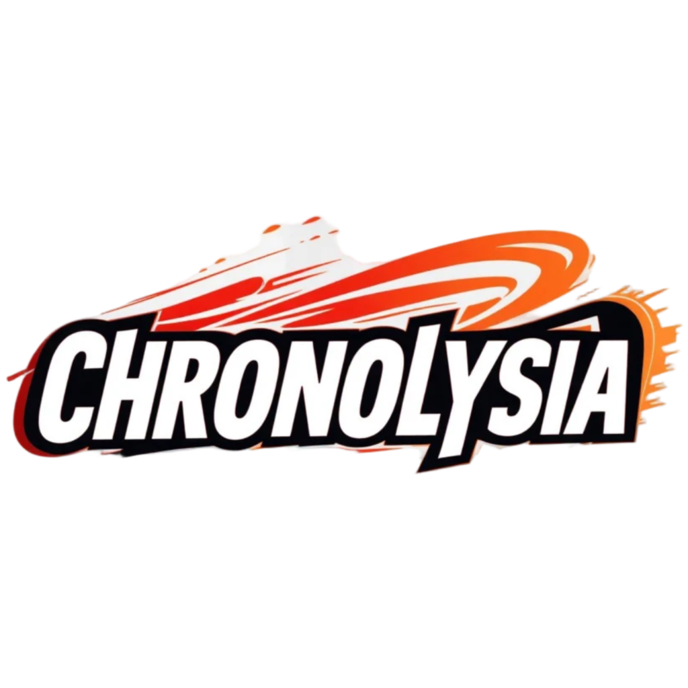

# Exploration to the unknown

## Development phase 🤔 

```
This project is still in early phase, if I finish it, release date should be between around 2027.
[█---------] 10%

👌 Offline mode & story mode.
🔭 Working on multiplayer features.

```

## About ℹ 

**Chronolysia** is an expansive, open-world multiplayer game set in a vast, ever-evolving world where time itself is a tangible force. Players step into the shoes of *Chronomancers*, powerful individuals who harness the ability to manipulate time, traveling across different epochs—past, present, and future. 

The world of **Chronolysia** is a vibrant tapestry of ancient ruins, futuristic cities, mystical forests, and timeless landscapes, all interconnected by the mysterious *Chrono Streams* that transcend the boundaries of time. Players can explore these realms, uncovering lost civilizations, forging alliances, and battling ancient forces that threaten to unravel the fabric of reality itself.

In **Chronolysia**, every decision has a ripple effect across players. Whether you’re helping to shape history, rewriting the fate of a forgotten kingdom, or altering the future of an entire civilization, your actions leave an indelible mark on the world. Players can team up with friends or forge their own path in a constantly shifting timeline, where no two journeys are ever the same.

## Key Features 🗝 

- **Dynamic World**: A living, breathing world that changes based on player actions, evolving in both the past and future.
- **Vast Open World**: Explore diverse regions, from ancient ruins to futuristic cities, each with its own story to tell.
- **Multiplayer**: Team up with friends to explore Chronolysia.
- **Rich Storytelling**: Dive into a deep narrative full of twists, where ancient prophecies, powerful enemies, and shifting allegiances await.
- **Clan Wars**: Join or create a clan to get unique abilities, missions, and goals.

In **Chronolysia**, future are yours to shape. The world is waiting—how will you leave your mark on time?

## Download & Setup 🖥 
### Windows X32, X64, X86
- Download the game via: **https://chronolysia.github.io/chronolysia/**.
- To setup, just open: `setup_chronolysia.exe`.
